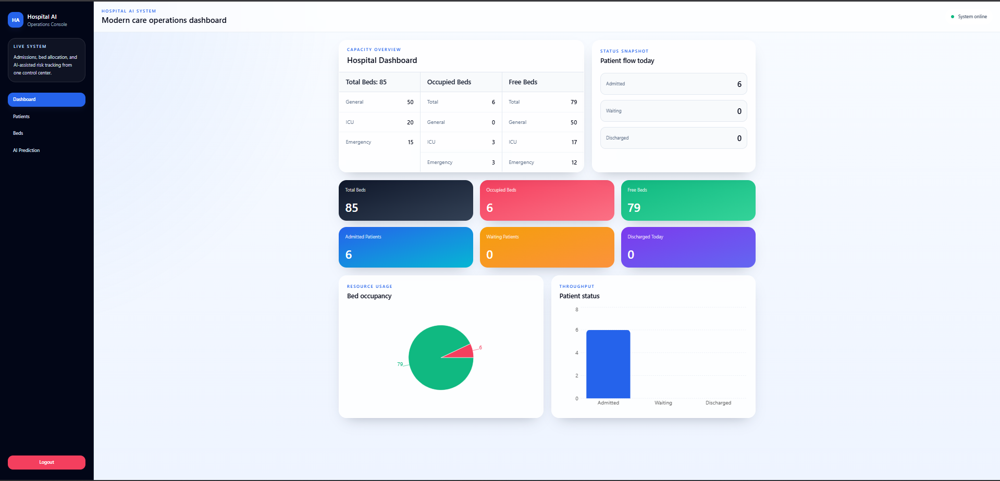
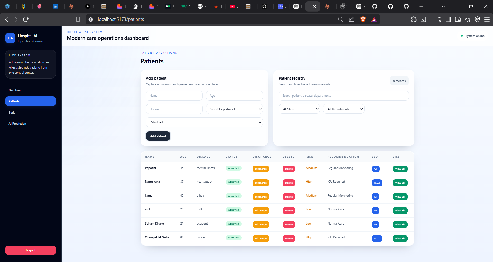
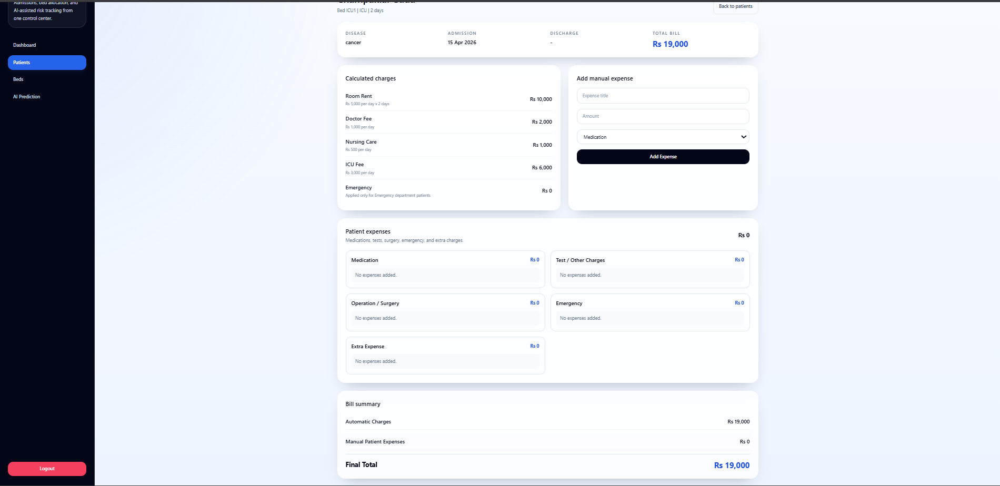
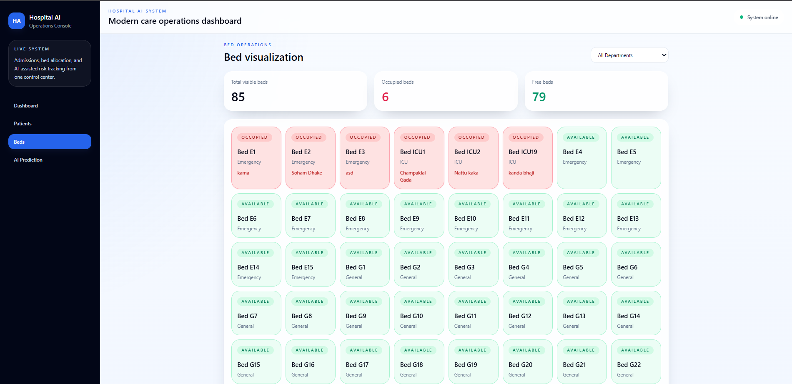
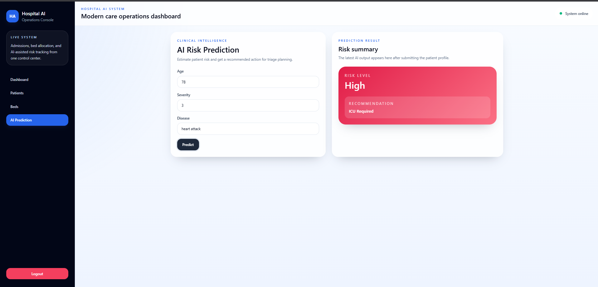

# 🏥 AI Hospital Patient Tracking System

## 🚀 Overview

A full-stack AI-powered system to manage hospital patients, bed allocation, billing, and risk prediction.

## 🔥 Features

* 🛏 Bed Allocation (ICU, General, Emergency)
* 👨‍⚕️ Patient Management
* 💊 Expense & Billing System
* 🧠 AI Risk Prediction
* 🔁 Auto Bed Reallocation

## 🛠 Tech Stack

* Frontend: React.js
* Backend: Node.js, Express.js
* Database: MongoDB
* AI: Python

## 📸 Screenshots## 

## 📸 Screenshots

### 🏠 Dashboard


### 👨‍⚕️ Patients


### 🧾 Billing


### 🛏 Beds



### 🧠 AI Prediction
## 📸 Screenshots


=======

### 🧠 AI Prediction


## ⚙️ Run Project

```bash
npm install
npm start
```

## 👨‍💻 Author

Soham Dhake
